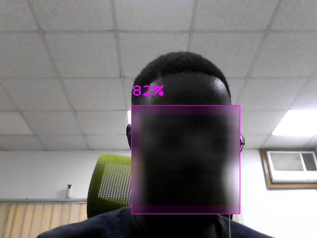

# Blur Faces Of Individuals Present In a Video Using Docker

Hi my name is `Moses Daudu` 

In this repo, You will see how to blur the faces of people within any video.
I didn't make use of any model, instead I used the `cvzone face detector module` which can correctly detect faces within an image or video

## Step 1:
move to the directory where the `Dockerfile` is, then run the following codes
#### Build the docker file with the appname of your choice 
`docker build -t python_appname .`
#### Run the docker file with the chosen appname 
`docker run python-appname`

Contact Moses at `mosesdaudu001@gmail.com` for adjustments to suit your needs.

### Side Notes:
I have chosen not to include a `requirements.txt` file, but if you do not have docker installed, the only 2 dependencies you would need to install are:
1. `opencv-python==4.5.5.64` 
2. `cvzone==1.5.6`

